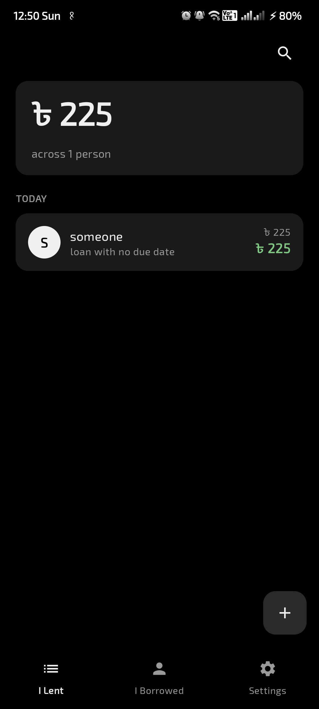
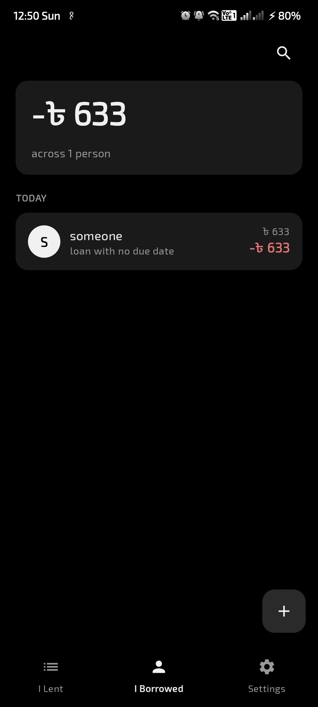
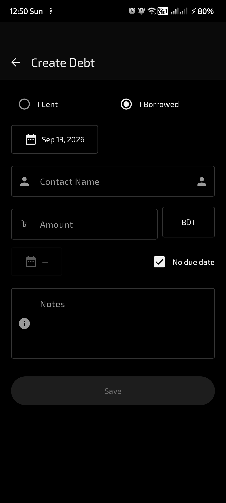

# Dena

Local-first debt & borrowing tracker for Android.

## Features

- Track money lent and borrowed, per contact
- Multiple currencies, themes, English/Bengali UI
- Export/import backups as `.dena` files
- All data stays on-device

## Screenshots

| Main Screen | Settings | Debt Detail |
| :---: | :---: | :---: |
|  |  |  |

## Tech

Kotlin · Jetpack Compose · Material 3 · Room

## Build

```bash
./gradlew :app:assembleDebug
```
